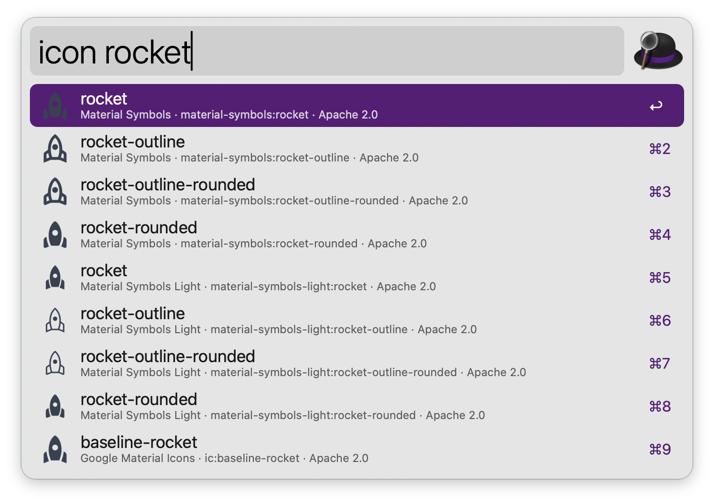

# Icon & Font Finder

Search SVG logos and 200k+ icons (Iconify, Lucide, Heroicons, Material, Simple Icons) and Google Fonts.

> **Status:** planned — not yet functional. See [PLAN.md](PLAN.md).

## Usage

Search SVG logos and 200k+ icons (Iconify, Lucide, Heroicons, Material, Simple Icons) and Google Fonts via the `icon` keyword.



* <kbd>↩</kbd> Primary action.
* <kbd>⌘</kbd><kbd>↩</kbd> Secondary action.
* <kbd>⌘</kbd><kbd>Y</kbd> Quick Look.

Every keyword can be changed in the Workflow’s Configuration.

## Development

```bash
./build.sh   # -> dist/alfred-icon-finder-<version>.alfredworkflow
```

## AI disclosure

This workflow is developed with the help of Claude (Anthropic), an AI assistant. All code is reviewed and tested by the author.
