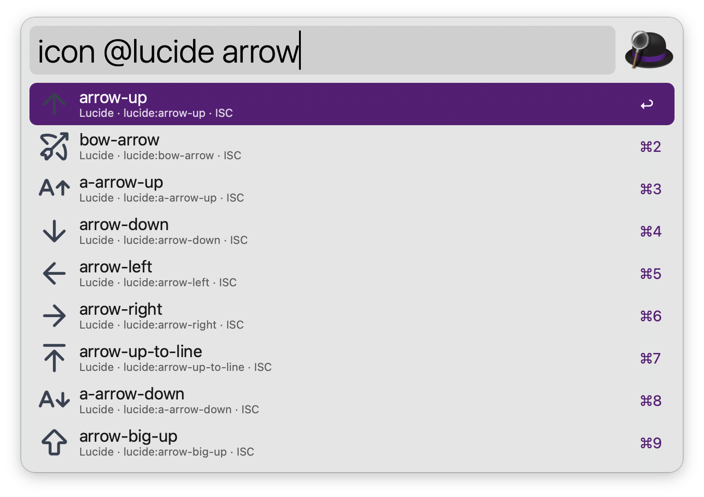
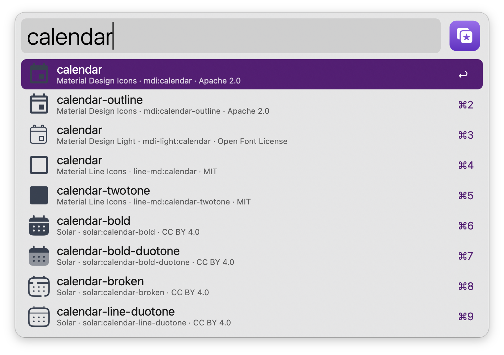
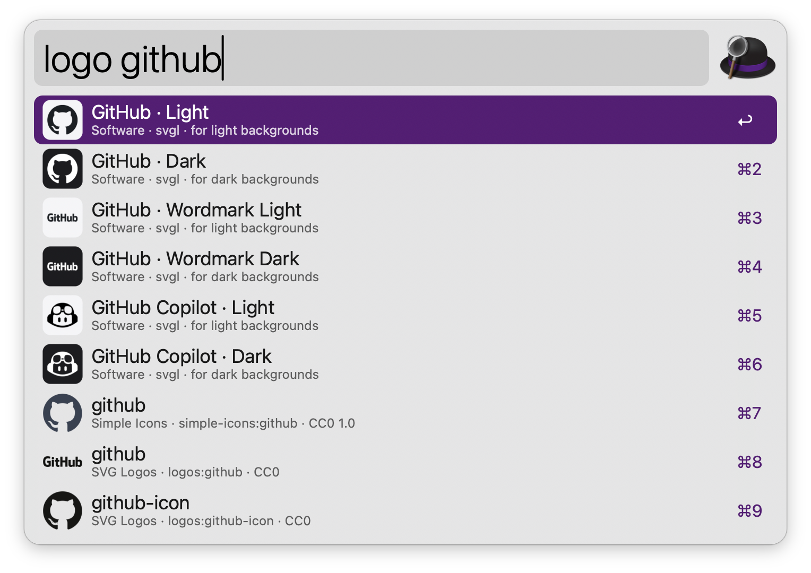
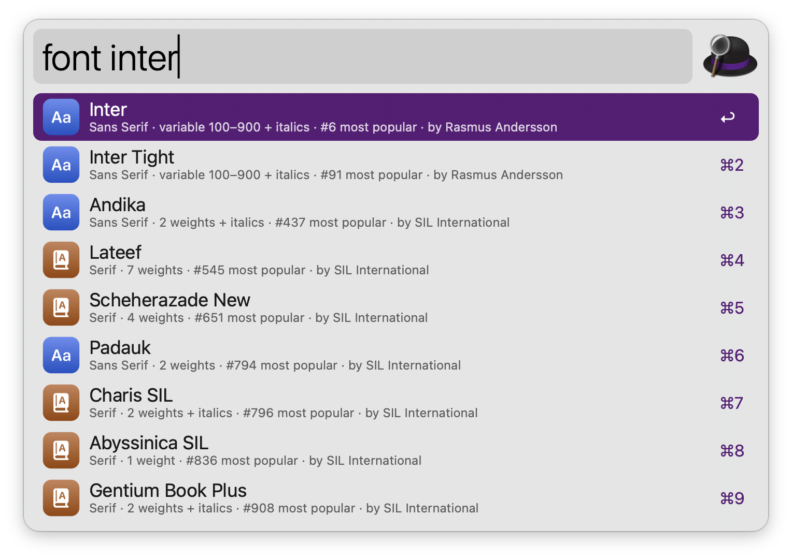
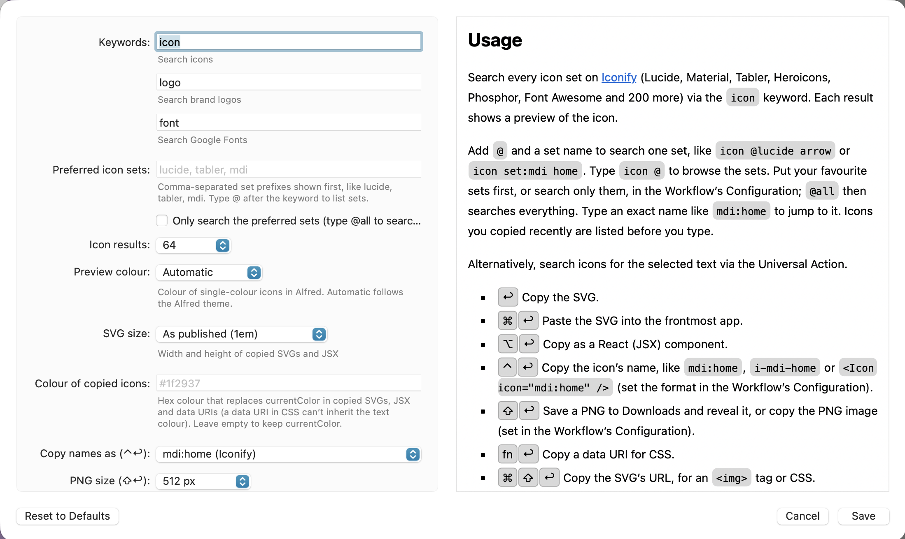

#  Icon & Font Finder

Search 200,000+ open source icons, SVG brand logos and Google Fonts in Alfred, with live previews. Copy an icon as SVG, a React component, a data URI or a PNG, and copy a font’s embed code. No dependencies and no API keys.

## Usage

Search every icon set on [Iconify](https://icon-sets.iconify.design) (Lucide, Material, Tabler, Heroicons, Phosphor, Font Awesome and 200 more) via the `icon` keyword. Each result shows a preview of the icon.


Add `@` and a set name to search one set, like `icon @lucide arrow` or `icon set:mdi home`. Type `icon @` to browse the sets. Put your favourite sets first, or search only them, in the Workflow’s Configuration; `@all` then searches everything. Type an exact name like `mdi:home` to jump to it.



Alternatively, search icons for the selected text via the Universal Action.



* <kbd>↩</kbd> Copy the SVG.
* <kbd>⌘</kbd><kbd>↩</kbd> Paste the SVG into the frontmost app.
* <kbd>⌥</kbd><kbd>↩</kbd> Copy as a React (JSX) component.
* <kbd>⌃</kbd><kbd>↩</kbd> Copy the icon’s name, like `mdi:home`, `i-mdi-home` or `<Icon icon="mdi:home" />` (set the format in the Workflow’s Configuration).
* <kbd>⇧</kbd><kbd>↩</kbd> Save a PNG to Downloads and reveal it.
* <kbd>fn</kbd><kbd>↩</kbd> Copy a data URI for CSS.
* <kbd>⌘</kbd><kbd>⌥</kbd><kbd>↩</kbd> Open the icon on Iconify.
* <kbd>⌘</kbd><kbd>Y</kbd> Quick Look the icon.

### Logos

Search [svgl](https://svgl.app)’s SVG brand logos, with light and dark variants and wordmarks, via the `logo` keyword. When svgl has few matches, logos from Simple Icons and SVG Logos follow. The keys are the same as for icons.



### Fonts

Search Google Fonts via the `font` keyword. Results show the category, weights, whether the font is variable, and its popularity. Start with a category to filter, like `font serif:` or `font mono:code`, or type a category alone to list its most popular fonts.



* <kbd>↩</kbd> Open the font on Google Fonts.
* <kbd>⌘</kbd><kbd>↩</kbd> Copy the `<link>` embed code with every weight.
* <kbd>⌥</kbd><kbd>↩</kbd> Copy the CSS `@import`.
* <kbd>⌃</kbd><kbd>↩</kbd> Copy the `font-family` declaration.
* <kbd>⇧</kbd><kbd>↩</kbd> Copy the Next.js `next/font` import.
* <kbd>fn</kbd><kbd>↩</kbd> Copy the stylesheet URL.

Results are cached, so everything you searched before still works offline. Set the preview colour, the size and colour of copied SVGs (a colour replaces `currentColor`, which a data URI in CSS can’t inherit), the PNG size, colour and folder, and the preview cache size in the Workflow’s Configuration. Every keyword can be changed there too.



## Development

```bash
swift tools/make_icons.swift tools/icons.json src   # regenerate icons
python3 tools/build.py --package                     # write src/info.plist and dist/*.alfredworkflow
python3 tests/test_icon_finder.py                    # run the tests (IF_LIVE=1 adds a live API smoke test)
```

## AI disclosure

This workflow was developed with the help of Claude (Anthropic), an AI assistant. The code is reviewed and tested by the author.
